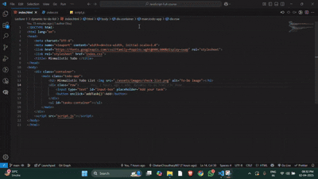

# Minimalistic To-Do List

A simple and elegant to-do list application built using HTML, CSS, and JavaScript. This project is designed to help users manage their daily tasks efficiently.

## Features
- Add, mark as completed, and delete tasks.
- Responsive and clean user interface.
- Minimalistic design with a focus on user experience.

## Demo


## Getting Started

### Prerequisites
Ensure you have a modern web browser (e.g., Chrome, Firefox) installed.

### Installation
1. Clone the repository:
```bash
 git clone https://github.com/amMistic/JavaScript
```
2. Navigate to the project directory:
```bash
 cd dynamic-to-do-list
```
3. Open the `index.html` file in your preferred web browser.

## Usage
- Type your task in the input field and click "Add" to add it to the list.
- Click on a task to mark it as completed.
- Click the "×" icon to delete a task.

## Project Structure
```
├── index.html          # Main HTML file
├── index.css           # Stylesheet for the app
├── script.js           # JavaScript logic for the app
└── assets              # Contains images and other assets
```

## Technologies Used
- HTML
- CSS
- JavaScript

## License
This project is open-source and available under the MIT License.

